# Scotch Game Repertoire (1.e4 e5 2.Nf3 Nc6 3.d4)

## Opening Principles
The Scotch Game follows core opening principles:
1. **Center Control**: Immediate challenge to Black's center with 3.d4
2. **Development with Tempo**: Most pieces are developed with threats
3. **Pawn Structure**: Our e4+d4 center dictates kingside attacking plans
4. **Attack Direction**: With pawns on e4/d4, we focus on kingside attacks

## Initial Position after 1.e4 e5 2.Nf3 Nc6 3.d4
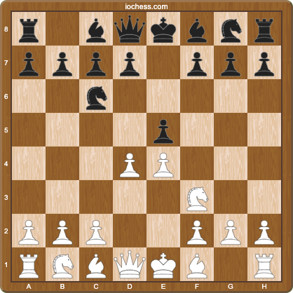

After 3.d4, we reach the defining position of the Scotch Game. This move exemplifies two key principles:
1. **Center Priority**: We challenge Black's center immediately rather than developing more pieces
2. **Tempo Gain**: After the exchange on d4, our knight recaptures with tempo on c6

### Development Order
Our ideal development sequence:
1. Control center with e4, d4
2. Develop knights to f3, d4 (fewest options first)
3. Place bishop on e3 (attacking Black's bishop)
4. Support center with c3 or develop to c3
5. Complete development with Bd3 and 0-0

## Main Line with 4...Bc5
After 1.e4 e5 2.Nf3 Nc6 3.d4 exd4 4.Nxd4 Bc5, we have three major options:

### A) 5.Be3! (Main Line - 55.3% for White)
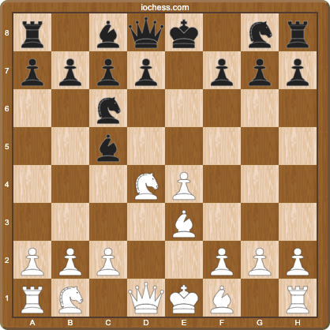

The sharpest and most principled continuation. This follows our development principles:
- Develops with tempo (attacking Bc5)
- Controls key central squares (e3 supports d4)
- Maintains flexibility for knight development

#### A1) 5...Qf6 (Most Common - 72.1%)
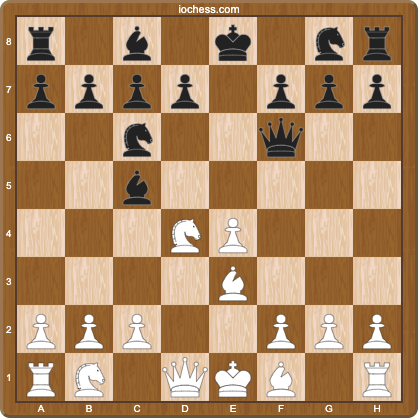

After 5...Qf6, White has two strong options:

##### A1.1) 6.c3! (Main Line - 79.3%)
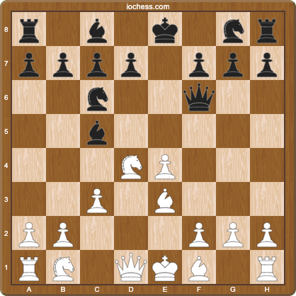
- White scores 52.2%
- Most popular and solid approach

**Pawn Structure Analysis:**
- c3 supports our d4 center
- Creates a potential d4-d5 break
- Gives our pieces safe squares on d3 and c2
- Attack direction: With strong center, focus kingside

**Development Plan:**
1. Bd3 (develops toward kingside attack)
2. 0-0 (king safety)
3. Re1 or Qd2 (connecting rooks, eyeing kingside)

After 6.c3, Black's main responses:

###### A1.1.1) 6...Nge7 (Main Line - 81.0%)
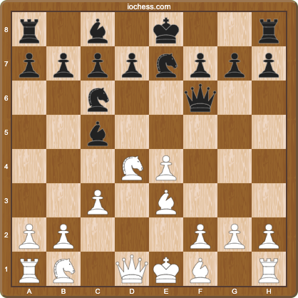
- White scores 51.9%
- Most natural development
- White's plan:
  * 7.Bd3! preparing 0-0
  * Watch for ...Ng6 ideas
  * Consider f4-f5 advance
  * Control d5 square

Common mistakes to avoid:
1. Don't play 7.Qxe3? allowing ...Qxe4+
2. Don't rush with Nc7+ without proper support
3. Watch for ...Qxb2 tricks

Practical Tips for 6.Nb5 line:
- Use this line when you need a win
- Perfect for rapid/blitz games
- Requires precise calculation
- Black often struggles to find best defense

###### A1.1.2) 6...Bb6 (5.1%)
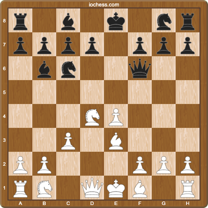
- White scores 53.5%
- Solid but passive
- White's plan:
  * Quick development with Bd3, 0-0
  * Prepare Nd5 advance
  * Control light squares

###### A1.1.3) 6...Qg6!? (4.8%)
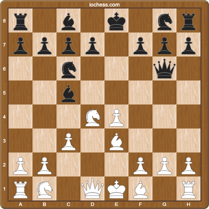
- White scores only 45.2%
- Sharp counterplay
- White's best response:
  * 7.Bd3! Qg4 8.0-0!
  * Important: Don't weaken kingside with h3

###### A1.1.4) 6...d6 (4.8%)
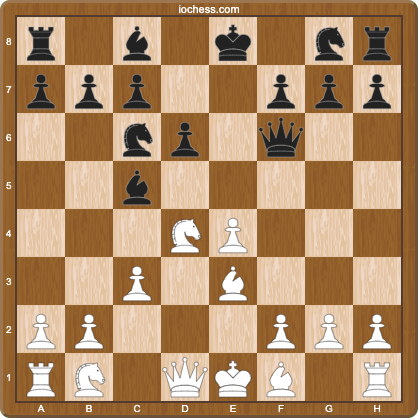
- White scores 55.7%
- Too passive for Black
- White's plan:
  * Standard development
  * Control e5 square
  * Prepare f4-f5 advance

##### A1.2) 6.Nb5! (Sharp Line - 18.5%)
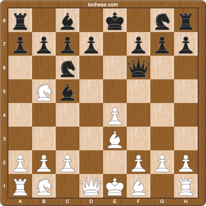
- White scores an impressive 65.0%
- Aggressive approach recommended for must-win games
- Key ideas:
  * Immediate pressure on d6
  * Threatens Nc7+ fork
  * Forces Black to weaken kingside with ...g6

**Pawn Structure Priority:**
- Maintains flexible center with e4
- Prepares c3 to support d4
- Attack direction: Center-kingside due to e4 pawn

**Development with Purpose:**
- Knight to b5 threatens c7
- After ...Bxe3, fxe3 opens f-file for attack

After 6.Nb5, Black has essentially one main response:

###### A1.2.1) 6...Bxe3! (98.3%)
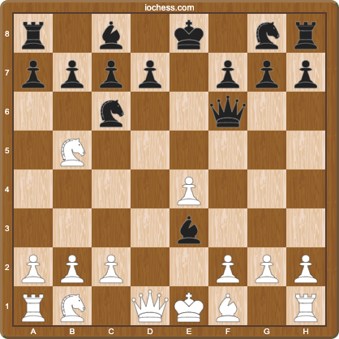
- White scores 64.7%
- Forced exchange
- White's plan:
  * 7.fxe3! (maintaining control of d4)
  * Prepare c3 and d4
  * Look for Nc7+ opportunities
  * Control dark squares after ...g6

#### A2) 5...Bb6 (Second Main Line - 15.7%)
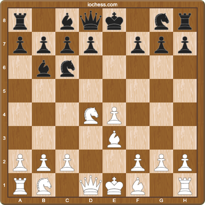
- White scores 52.9%
- More positional approach
- Focus on central control

**Center Control Strategy:**
- Maintain e4+d4 center
- Prepare d4-d5 advance when supported
- Attack direction: Kingside due to e4 pawn

**Development Sequence:**
1. Choose between Nc3 (flexible) or Nf5 (aggressive)
2. Complete development toward kingside
3. Look for central breaks with d5

After 5...Bb6, White has several strong options:

##### A2.1) 6.Nc3! (29.4%)
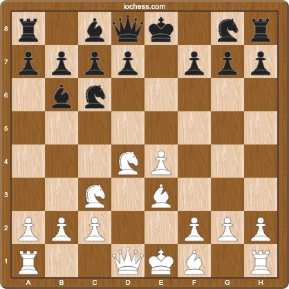
- White scores 55.8%
- Most active approach

**Pawn Structure and Attack Direction:**
- Strong e4+d4 center points to kingside attack
- Prepare d4-d5 advance to open lines
- Control dark squares after ...Nf6

**Development Priority:**
1. Complete kingside development (Bd3, 0-0)
2. Connect rooks with Re1
3. Prepare pawn breaks with f4/d5

Key ideas:
* Quick development toward kingside
* Prepares d5 advance at the right moment
* Controls central squares
* Maintains flexibility for pawn structure

After 6.Nc3, Black has three main responses:

###### A2.1.1) 6...Nge7 (36.6%)
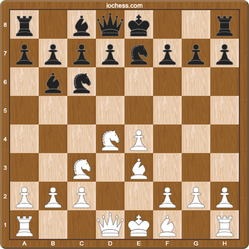
- White scores 56.5%
- Most popular continuation
- White's plan:
  * 7.Bd3! preparing 0-0
  * Watch for ...Ng6 ideas
  * Consider f4-f5 advance
  * Control d5 square

Practical Tips:
- Focus on rapid development
- Don't rush with d5
- Watch for ...Ng4 tricks
- Keep the bishop pair when possible

###### A2.1.2) 6...Nf6 (33.4%)
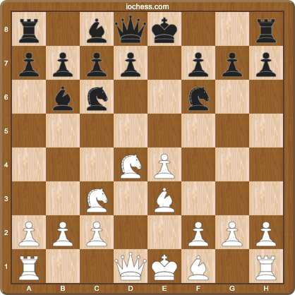
- White scores 52.8%
- More aggressive setup
- White's plan:
  * 7.f3! controlling e4
  * Prepare d4-d5
  * Look for kingside attack
  * Watch for ...d5 break

###### A2.1.3) 6...d6 (24.6%)
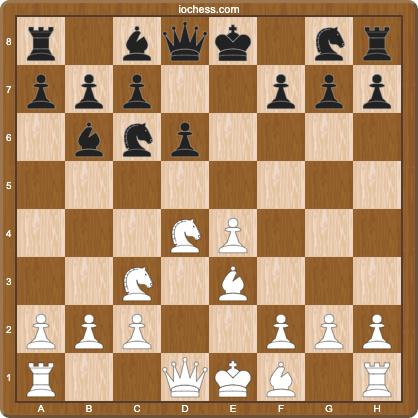
- White scores 58.6%
- Too passive for Black
- White's plan:
  * Quick development
  * Control e5 square
  * Prepare f4 advance
  * Look for d5 breaks

##### A2.2) 6.Nf5! (13.0%)
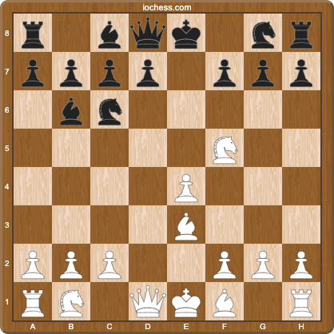
- White scores 61.1%
- Sharp tactical approach

**Pawn Structure Dynamics:**
- Maintain e4 center pawn
- Prepare f2-f4 kingside expansion
- Use e4 pawn to support kingside attack

**Development with Initiative:**
1. Place pieces for kingside attack
2. Keep e4 pawn flexible
3. Look for tactical shots on f7

Key ideas:
* Threatens Ne7+ fork
* Controls key central squares
* Forces Black to weaken kingside

After 6.Nf5, Black has three main responses:

###### A2.2.1) 6...Qf6 (55.1%)
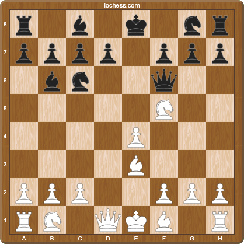
- White scores 62.3%
- Most common response
- White's plan:
  * 7.Bd3! preparing castling
  * Watch for ...g6 weakening
  * Control e4-e5 center
  * Look for tactical shots

###### A2.2.2) 6...Bxe3 (19.4%)
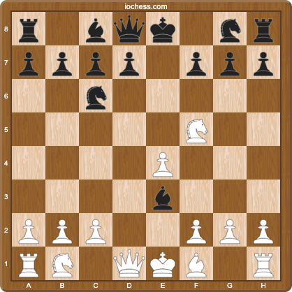
- White scores 58.2%
- Forced exchange
- White's plan:
  * 7.fxe3! (not Qxe3?)
  * Control dark squares
  * Use e-file for attack
  * Watch for ...d5 break

###### A2.2.3) 6...g6 (16.6%)
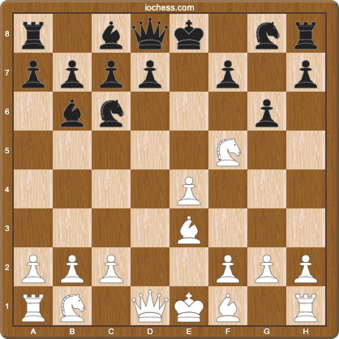
- White scores 61.8%
- Weakens kingside
- White's plan:
  * 7.Nxh6! gxh6
  * Attack weakened kingside
  * Use open g-file
  * Quick development with Bd3

##### A2.3) 6.c3 (23.4%)
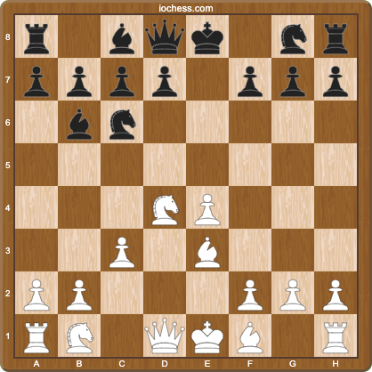
- White scores 48.0%
- Solid but less ambitious

**Pawn Structure Analysis:**
- Strong central pawn chain e4-d4-c3
- Prepare d4-d5 break when supported
- Attack direction: Center-kingside due to pawn chain

**Development Sequence:**
1. Complete development (Bd3, 0-0)
2. Prepare d5 advance
3. Look for f4-f5 kingside expansion

**Strategic Guidelines:**
- Focus on central control before kingside attack
- Maintain pawn chain integrity
- Time d5 break carefully

### B) 5.Nb3 (Alternative - 54.8% for White)
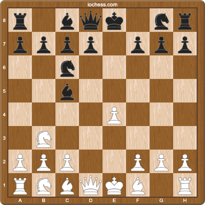
- Immediate pressure on c5
- Prepares c4 and d4 advances
- Good choice for aggressive players

### C) 5.Nxc6 (Solid Choice - 52.3% for White)
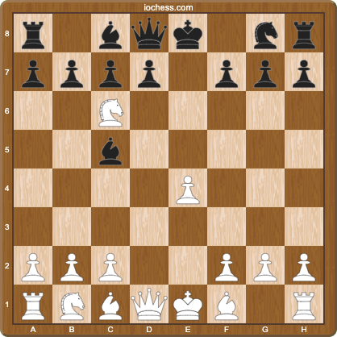
- Solid but less ambitious
- Leads to equal chances
- Good choice when drawing with White

## Strategic Themes
1. Central control with e4/d4
2. Quick development of pieces
3. King safety through timely castling
4. Control of d5 square
5. Potential for queenside expansion

## Key Tactical Motifs
1. d5 breaks
2. f4-f5 advances
3. Pin on f6
4. Discovered attacks with knights
